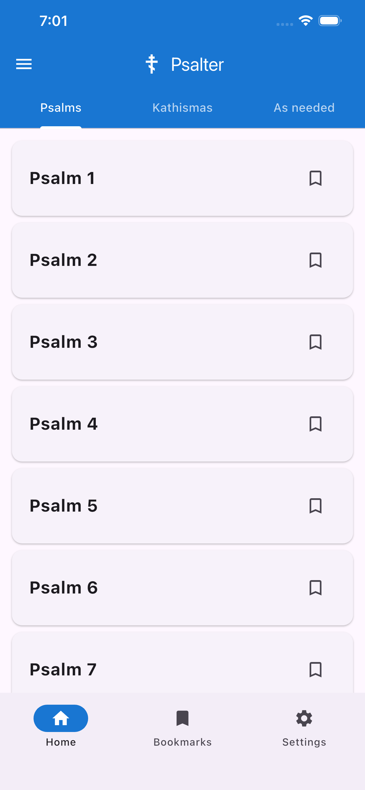
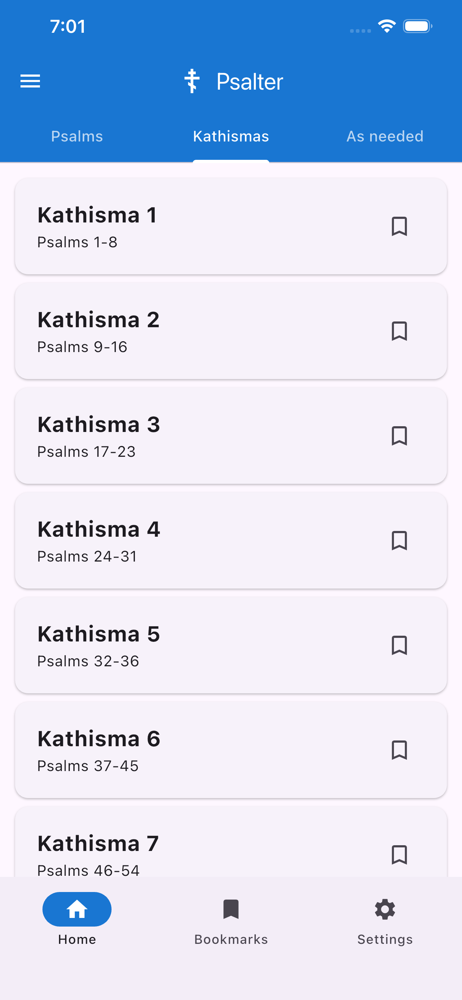
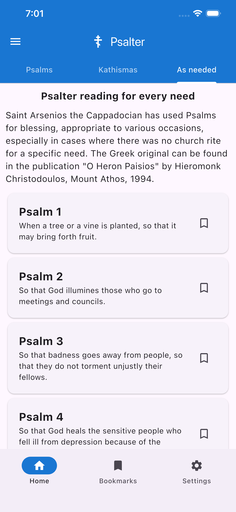
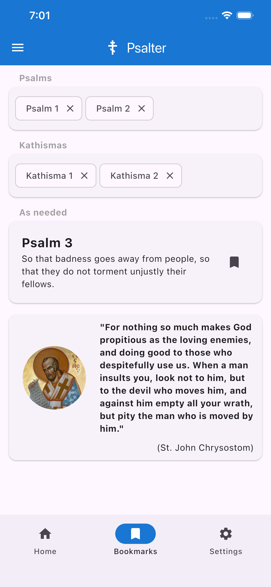
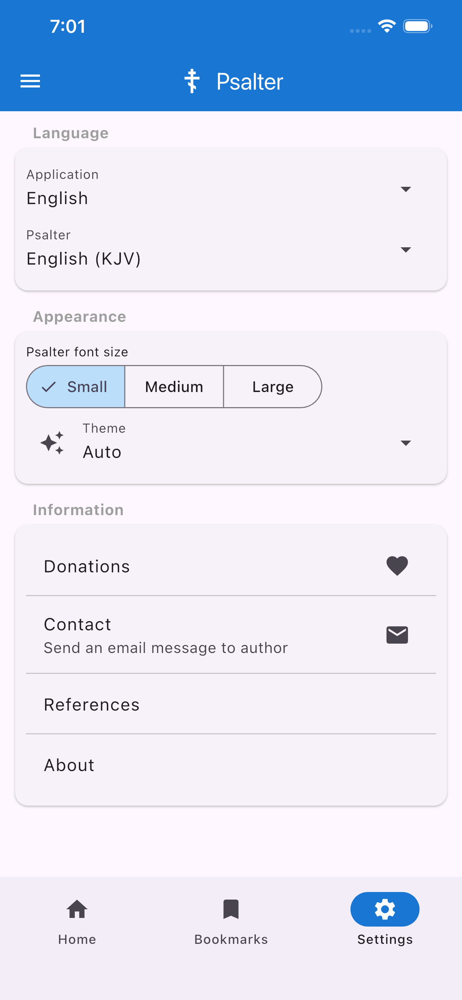

# App Info
Orthodox Psalter mobile application for easy reading experience

# Build Android
```bash
flutter build appbundle --release
```

# Build iOS
```bash
flutter build ipa
```

# QA autotests

Run autotests:
```bash
./generate_screenshots.sh
```

Maestro Test suites configuration file:
```bash
./maestro/screenshots.yaml
```

# Screenshots






